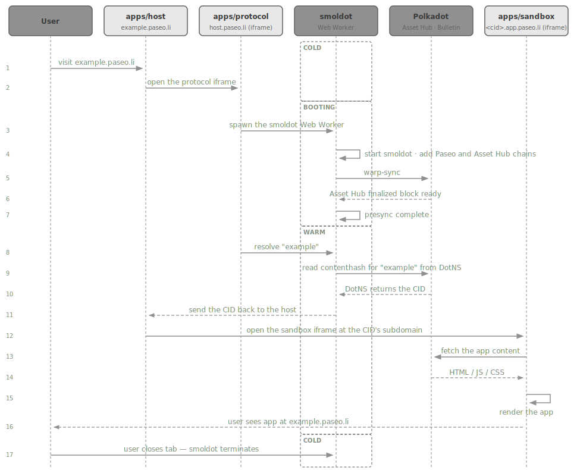
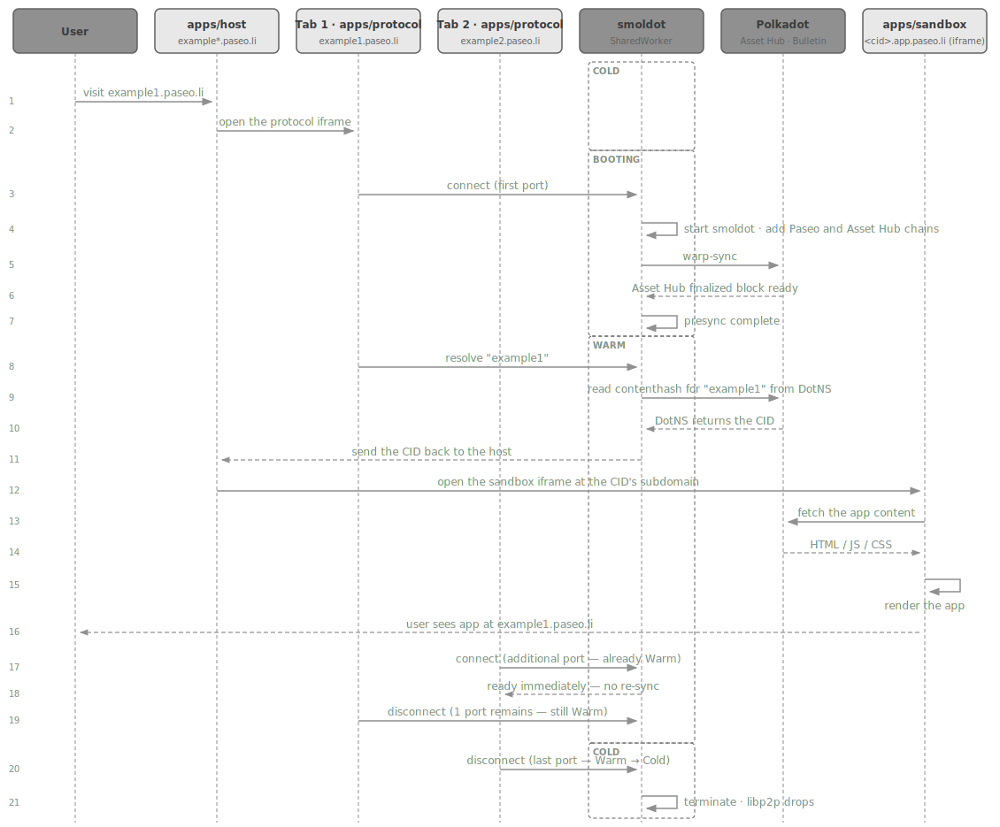

# Domain Resolution

## Architecture Overview

#### Per-Product Smoldot

#### Shared Smoldot

## Appendix

Table I — Cold-start latency distribution. End-to-end domain resolution across 20 runs (2026-04-24); the *actor* column matches the components in the Architecture Overview above.

| Checkpoint | Actor | min | **p50** | p90 | max |
|---|---|---:|---:|---:|---:|
| Paseo relay chain synced | smoldot | 112 ms | **122 ms** | 147 ms | 213 ms |
| Asset Hub finalized block ready | smoldot | 933 ms | **7.92 s** | 13.45 s | 42.23 s |
| Host receives the resolved content hash (CID) | apps/host | 2.10 s | **9.61 s** | 15.38 s | 44.67 s |
| Host shell ready | apps/host | 2.10 s | **9.62 s** | 15.39 s | 44.69 s |
| Sandbox IPFS client ready | apps/sandbox | 0.55 s | **0.62 s** | 0.69 s | 0.70 s |
| Sandbox content fetched (4.3 MB) | apps/sandbox | 217 ms | **338 ms** | 428 ms | 630 ms |
| Sandbox app rendered | apps/sandbox | 0.81 s | **1.01 s** | 1.07 s | 1.36 s |

## References

[1] Smoldot, Polkadot light-client implementation. <https://github.com/paritytech/smoldot>. Accessed on 2026-04-30.

[2] MDN Web Docs SharedWorker API. <https://developer.mozilla.org/en-US/docs/Web/API/SharedWorker>. Accessed on 2026-04-30.

[3] MDN Web Docs MessagePort interface. <https://developer.mozilla.org/en-US/docs/Web/API/MessagePort>. Accessed on 2026-04-30.
